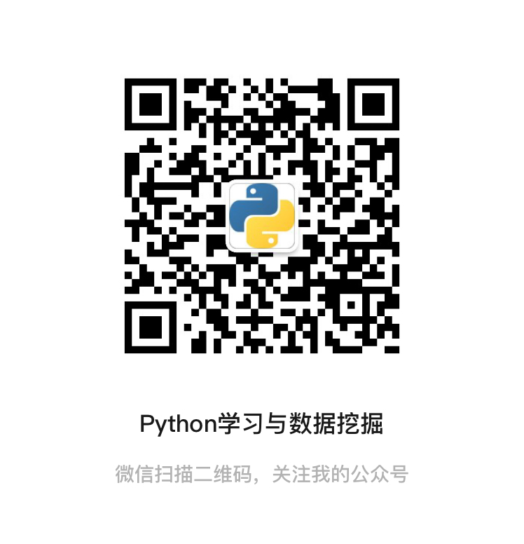

## 🙋 Hi there 🌱  知乎实战干货分享

为方便技术交流，本号开通了技术交流群，交流学习请添加小助手微信号：pythoner666，或者关注：微信公众号『Python学习与数据挖掘』，后台回复：加群

> 内容目录

- Python入门到进阶
- Python趣味篇

#### 1、Python

- [必须要掌握的Python代码，短小精悍，非常实用](https://mp.weixin.qq.com/s?__biz=MzAxNTAwNjQzNw==&mid=2448604047&idx=1&sn=3b3ccb279480fa2dd869dbfb6bb6cbaf&chksm=8f8cb405b8fb3d13d305b48bf07c0288d0d5adef1fb39b61cfafbb1d1f41f12a9fdc3801bef5&token=1265548966&lang=zh_CN#rd)

- [英伟达小姐姐的7大Python技巧合集，Github点赞量高达2500+](https://mp.weixin.qq.com/s?__biz=MzAxNTAwNjQzNw==&mid=2448605211&idx=1&sn=5f988aca48fcc9d86b41d88f62670838&chksm=8f8ccf91b8fb4687ba6645981ce82a98f67d25f0d081cb7e8ea687122b70a2c4422697f3e101&token=1265548966&lang=zh_CN#rd)

